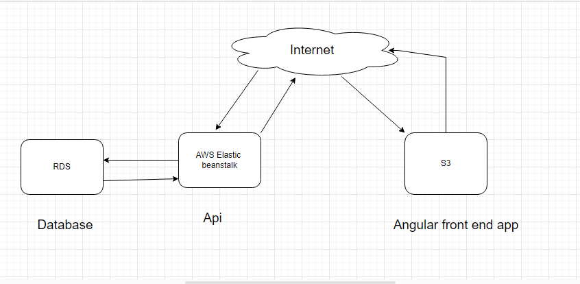

RDS

Database endpoint: database-1.csco5quqszgy.us-east-2.rds.amazonaws.com

user: postgres

Elastic Beanstalk

server url : http://udagram-api-development.eba-eexxpk8z.us-east-1.elasticbeanstalk.com/

S3

front end is uploaded on S3 for static web hosting, app url : http://udagram-backet-123456789.s3-website-us-east-1.amazonaws.com

