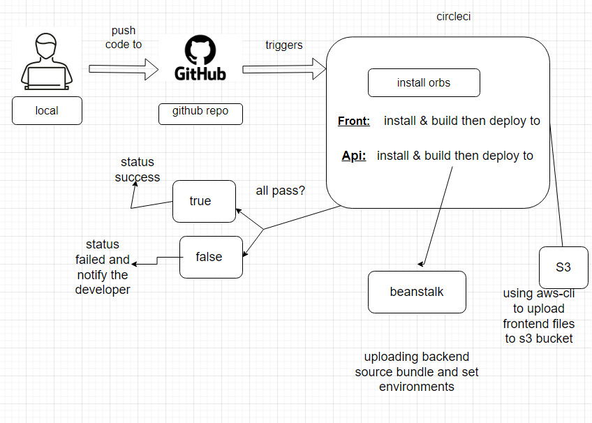

team work commit to same repo with different branches circle ci listen or trigger to each branch has circle ci config file and linked to circle ci app
and follow up cycle provided in config file as pipeline after succeed all steps it push it to deploy (front-end to s3-bucket and back to elastic beanstalk and set env to eb to link to db)

